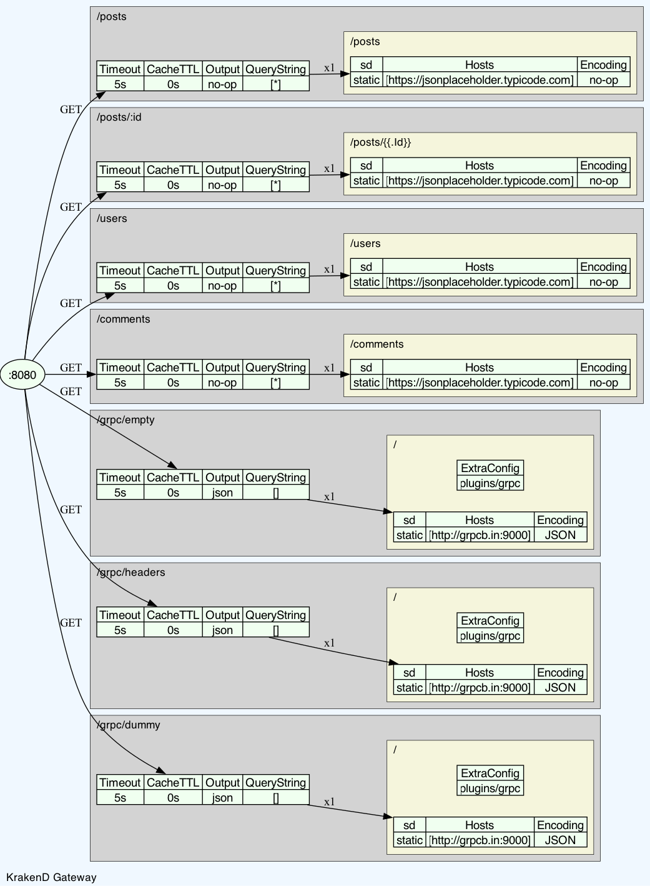

# API Gateway

[](https://github.com/omarfawzi/API-Gateway/actions/workflows/ci.yml)
[](https://github.com/omarfawzi/API-Gateway/actions/workflows/docker.yml)
[](https://codecov.io/github/omarfawzi/API-Gateway)

API Gateway is a high-performance, configurable API gateway built on top of [Lura (KrakenD)](https://github.com/luraproject/lura).


## Table of Contents

- [Clone the repository](#clone-the-repository)
- [Features](#features)
- [Configuration](#configuration)
- [Server Handlers](#server-handlers)
- [Proxy Req/Resp Modifiers](#proxy-reqresp-modifiers)
- [Client Handlers](#client-handlers)
- [Backend Middlewares](#backend-middlewares)
- [Dynamic Configuration File](#dynamic-configuration-file)
- [Build & Run](#build--run)
- [Diagram](#diagram)

### Clone the repository

```bash
git clone git@github.com:omarfawzi/API-Gateway.git
```

### Features

- Proxy requests to backend services
- Configurable via Lura v3 YAML configuration
- Debug and release modes
- Integrated Sentry error tracking

### Configuration
The gateway uses [Lura Configuration](https://www.krakend.io/docs/configuration/structure/) for setting up the gateway config.

### Server Handlers


- **Namespace**: `github_com/devopsfaith/krakend/transport/http/server/handler`.
- **Location**: root level of the config file.

To define custom server handlers, you need to do the following:

1. Define your handler module under `internal` directory.
2. Add your `handler.go` implementation of `github.com/luraproject/lura/v2/transport/http/server/plugin/plugin.Registerer`.
3. Define the `provider.go` method returning instance of your handler.
4. Register your server handler `internal/lura/servers/provider.go`
5. Provide your handler from step 3 to `ProvideServerHandlerRegistry` in `internal/wire.go`.

> All custom server handlers will still be handled by the Namespace `github_com/devopsfaith/krakend/transport/http/server/handler`.

```yaml
version: 3
...
extra_config:
  github_com/devopsfaith/krakend/transport/http/server/handler:
    name:
      - errors-server-handler
```

### Proxy Req/Resp Modifiers


- **Namespace**: `github.com/devopsfaith/krakend/proxy/plugin`.
- **Location**: endpoint level of the config file.

To define custom proxy handlers, you need to do the following:

1. Define your handler module under `internal` directory.
2. Add your `handler.go` implementation of `github.com/luraproject/lura/v2/proxy/plugin.Registerer`.
3. Define the `provider.go` method returning instance of your handler.
4. Register your server handler `internal/lura/proxy/provider.go`
5. Provide your handler from step 3 to `ProvideProxyHandlerRegistry` in `internal/wire.go`.

> All custom proxy handlers will still be handled by the Namespace `github.com/devopsfaith/krakend/proxy/plugin`.

### Client Handlers


- **Namespace**: `github.com/devopsfaith/krakend/transport/http/client/executor`.
- **Location**: backend level of the config file.

To define custom client handlers, you need to do the following:

1. Define your handler module under `internal` directory.
2. Add your `handler.go` implementation of `github.com/luraproject/lura/v2/transport/http/client/plugin.Registerer`.
3. Define the `provider.go` method returning instance of your handler.
4. Register your server handler `internal/lura/client/provider.go`
5. Provide your handler from step 3 to `ProvideClientHandlerRegistry` in `internal/wire.go`.

> All custom client handlers will still be handled by the Namespace `github.com/devopsfaith/krakend/transport/http/client/executor`.

### Backend Middlewares

You can define backend middlewares and provide them in `internal/lura/proxy/provider::ProvideProxyFactory`, and then assign them to specific backend as needed.

```yaml
endpoint: /users
method: GET
output_encoding: json
input_headers:
  - Authorization
backend:
  - url_pattern: /users
    method: GET
    host:
      - 'https://jsonplaceholder.typicode.com'
    encoding: json
    extra_config:
      github.com/devopsfaith/krakend-circuitbreaker/gobreaker:
        name: users-circuit-breaker
        interval: 60
        timeout: 1
        max_errors: 5
        log_status_change: true
```

For a list of opensource plugins, check https://github.com/krakend/krakend-ce/blob/master/backend_factory.go.

### Dynamic Configuration File
We use [Gomplate](https://github.com/hairyhenderson/gomplate) to dynamically generate the Lura configuration file (`config/config.json`) from a template (`config/config.yaml`). 

This approach provides flexibility by allowing values to be injected through environment variables.

#### 📄 Example

```yaml
version: 3
name: api-gateway
port: {{ getenv "APP_PORT" | default "8080" }}
```

In this example, the application port is sourced from the `APP_PORT` environment variable, defaulting to `8080` if not set.

This method is particularly useful for securely passing secrets or environment-specific values. For instance, you can inject Basic Auth headers using both [Martian](https://github.com/google/martian) and Gomplate:

```yaml
backend:
  - encoding: json
    method: GET
    url_pattern: /comments
    extra_config:
      github.com/devopsfaith/krakend-martian:
        header.Modifier:
          scope: [request]
          name: X-Custom-Env
          value: {{ getenv "MY_ENV_TAG" | default "test-env" }}
```

> Gomplate is not used at runtime or during the application bootstrap. It runs only as an entrypoint in the container to generate the final configuration file.

---
### Build & Run

#### 🔧 Running Without Docker 

```shell
make run CONFIG_TEMPLATE_FILE=api.yaml
```

#### 🐳 Running with Docker (recommended)

```shell
make docker
```

### Diagram

To generate diagrams out of the config file, you can try 

```shell
make draw-krakend CONFIG_TEMPLATE_FILE=api.yaml
``` 

this would generate a diagram like the one below


